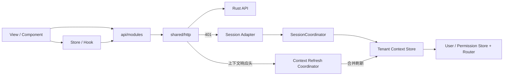

# RyFrame Vue3 架构与演进指南

> 最后核对：2026-08-17
> 适用范围：独立前端仓库 `ryframe-vue3`

前端与 Rust 后端分别维护 Git、版本和 CI，只通过 `/api/v1`、OpenAPI、认证/租户头和稳定 `route_key` 协作。前端只维护与后端同名的稳定标签，项目级源码 Release 由后端仓库统一发布。

## 1. 当前目录

```text
openapi/openapi.json             # 后端发布契约的仓库快照
scripts/                         # 源码、架构和 API 契约门禁
src/
├── app/session/                 # 刷新、退出和全局会话协调
├── app/messages/                # 消息 Query、mutation 与 WebSocket 传输
├── app/tenant-context/          # 租户会话上下文、能力判断和强一致刷新
├── features/                    # 功能清单、能力映射和领域级共享规则
├── shared/
│   ├── config/                  # 启动时校验的只读运行时配置
│   ├── http/                    # 纯 Axios 客户端、协议类型和结构化错误
│   └── security/                # 从 OpenAPI 生成的密码策略与验证器
├── api/
│   ├── contract.ts              # 生成类型的稳定查询/请求/响应入口
│   ├── generated/schema.ts      # openapi-typescript 生成，禁止手改
│   └── modules/                 # 按资源组织的语义化请求函数
├── router/
│   ├── index.ts                 # Router 组合根
│   ├── navigationGuard.ts       # 可注入的导航守卫
│   ├── runtimeRouteRegistry.ts  # 动态路由注册和清理
│   ├── menuRouteBuilder.ts      # 菜单转换纯函数
│   ├── pageRegistry.ts          # route_key 到本地页面的安全白名单
│   └── routes/                  # 常量路由
├── stores/                      # 客户端跨页面状态与连接状态
├── components/                  # 布局和可复用组件
├── hooks/                       # 可复用组合式逻辑
├── directives/                  # 权限和交互指令
├── utils/                       # 无状态工具
└── views/                       # 页面编排，包括 platform 套餐、租户和数据目标
```

运行时响应包络和 `Id` 位于 `shared/http/types.ts`。业务传输类型以 `openapi/openapi.json` 的生成结果为权威，API 模块只导出生成类型别名、必要的语义窄类型和请求函数。后端套餐、租户上下文和数据放置契约尚未进入仓库 OpenAPI 快照的过渡期内，只允许保留已批准的本地窄 DTO；契约稳定后必须切换生成类型并删除这套临时定义。

## 2. 依赖方向



| 模块 | 负责 | 禁止 |
| --- | --- | --- |
| `shared/http` | Axios、请求头、响应包络、单飞刷新和 `HttpError` | 导入 Store、Router、Element Plus 或业务 API |
| `api/modules` | 语义化请求函数、生成契约别名和有明确退出条件的临时窄 DTO | 弹消息、跳转、修改 Store，或长期维护第二套契约 |
| `app/session` | Token 生命周期、完整 `SessionContext` 交接和退出清理 | 页面展示逻辑 |
| `app/tenant-context` | 原子应用会话上下文、能力判断、epoch/状态变化合并刷新 | 复制服务端查询列表、直接展示消息 |
| `features` | `capabilityCode`、`routeKey`、权限、懒加载页面和套餐编辑器的静态映射 | 保存租户运行时状态、绕过后端授权 |
| QueryClient | 保存按租户、用户和查询参数隔离的服务端状态 | 保存 Token 或客户端偏好 |
| Store | 保存客户端跨页面状态、连接状态和派生状态 | 复制 QueryClient 中的服务端数据、操纵 Axios 拦截器 |
| View | 页面编排和交互 | 直接读写 Token 存储、拼后端基础 URL |

ESLint 对 `shared` 和 `api/modules` 的禁止依赖进行编译期检查。

## 3. 运行时链路

### 3.1 应用装配

`main.ts` 的顺序是：

1. 安装 Pinia。
2. 安装 `SessionCoordinator`，向 HTTP 客户端注入会话适配器。
3. 安装 Router，使首次导航可以安全读取 Store。
4. 安装 Element Plus、指令并挂载应用。

### 3.2 HTTP 和会话

- JSON 请求返回 `ApiResponse<T>` 或 `PageResponse<T>`。
- 文件请求使用 `requestBlob`，Prometheus 等文本使用 `requestText`。
- access token 自动写入 `Authorization`。
- 登录前租户写入 `X-Tenant-Id`；登录后租户与服务端主体保持一致。
- 并发 `401` 共享一次刷新请求；刷新失败只执行一次全局清理。
- 刷新使用独立 `rawRequest`，不会递归触发响应拦截器。
- `423`/`503` 会保留 `Retry-After`，由页面或轮询策略决定何时重试；不得用高频重试掩盖租户维护或迁移状态。
- `Id` 统一为 `string`，禁止转换为 JavaScript `number`。

### 3.3 会话与租户上下文

登录响应、刷新响应和 `GET /auth/context` 返回同一份完整 `SessionContext`：

```text
user + roles + permissions
+ authorization_epoch + runtime_epoch
+ capabilities[{ code, variant, schema_version, client_config }]
+ business_data{ state, placement_generation }
+ menus
```

- `app/tenant-context/store.ts` 先完整校验上下文，再原子更新 User Store、Tenant Context Store、Permission Store 和动态路由所需状态；任一字段不合法或强一致刷新失败时清空上下文并 fail-closed。
- 会话能力只接收面向客户端的 `client_config`，不得复用套餐编辑中的 `capability_code`、`variant_code` 和服务端 `config`。
- `business_data.state` 只有 `provisioning | active | maintenance | failed`。非 `active` 时显示全局业务数据状态横幅，并禁用 feature manifest 明确标记的业务写操作；系统管理写操作不受该规则影响。
- HTTP 传输层读取 `X-Authorization-Epoch`、`X-Tenant-Runtime-Epoch`、`X-Tenant-Data-Generation`、`X-Tenant-Data-State`。授权 epoch、运行时 epoch、放置 generation 或业务数据状态任一变化，`contextRefresh.ts` 都会把并发信号合并为一次 `/auth/context` 强一致刷新。
- WebSocket 只接受完整 v1 上下文变更帧，随后走同一刷新协调器，不直接局部修补 Store：

```json
{
  "v": 1,
  "type": "tenant_context_changed",
  "authorization_epoch": 42,
  "runtime_epoch": "18",
  "placement_generation": "7",
  "business_data_state": "maintenance"
}
```

### 3.4 消息中心

- 收件箱页、未读数、加载和刷新状态只保存在 TanStack Query；查询键固定包含租户、用户、过滤条件和游标。
- WebSocket 消息投递直接按消息 ID 合并到 QueryClient；`tenant_context_changed` 则只触发租户上下文强一致刷新。连接成功、重连成功及连接存续期间每 60 秒通过 REST 补拉；服务端以 `503`、`Retry-After` 和 `X-RyFrame-Realtime: unavailable` 声明实时服务不可用时，前端保持降级状态并按该间隔低频健康重试，不进入短周期重连。
- 确认送达、单条已读和全部已读统一走 mutation；送达确认按 100 条分批并在失败后有界退避。
- `stores/message.ts` 只保存连接状态和不可观察的传输运行时，不得复制消息列表或未读数。

### 3.5 动态路由

```text
登录/刷新中的 session_context，或 GET /auth/context
  -> Tenant Context Store 校验并原子应用
  -> feature manifests 校验能力、variant、route_key 和 permission
  -> pageRegistry 校验 route_key
  -> buildRoutesFromMenuTree
  -> buildAccessibleMenus
  -> RuntimeRouteRegistry 注册
  -> Permission Store 保存菜单状态
```

启动链路不再单独请求用户信息或当前菜单。角色、权限、能力和菜单只取同一 `SessionContext` 快照；后端不能指定任意组件路径。未知 `route_key`、按钮节点、停用节点、隐藏节点、能力不匹配节点和无权限空目录会被安全丢弃。上下文 epoch 变化后重新构建路由并裁剪不可访问标签页；退出或身份切换时，`RuntimeRouteRegistry` 会完整移除上一主体的动态路由。

### 3.6 功能清单与能力

`src/features/manifest.ts` 定义通用 feature manifest。每项必须同时声明：

- `capabilityCode`、稳定 `routeKey` 和入口 `permissionCode`；
- 懒加载页面、`allowedVariants` 和 `planConfigEditor`；
- 需要在业务数据非 `active` 时禁用的 `businessWritePermissions`。

`src/features/registry.ts` 聚合 manifests，`pageRegistry` 从聚合结果加入能力页面，避免页面白名单与能力映射维护两份重复条目。服务账号当前映射为 capability `system.service_accounts`、route key `system.service-accounts`、variant `default`；是否可见和可用只取决于 `SessionContext`。

### 3.7 产品套餐、租户产品上下文与数据放置

以下路径均相对于生成的 `/api/v1` 前缀：

| 领域 | API 边界 |
| --- | --- |
| 产品套餐 | `/platform/product-plans`、`/platform/product-plans/{id}/versions`、`/platform/product-plans/{id}/versions/{version}/draft` 及 publish/retire 动作 |
| 租户产品上下文 | `/platform/tenants/{tenant_id}/product-context`、`/platform/tenants/{tenant_id}/product-change-previews`、`/platform/tenants/{tenant_id}/product-changes` |
| 数据目标与备份点 | `/platform/data-targets`、`/platform/data-targets/{key}/backup-points` |
| 租户数据放置 | `/platform/tenants/{tenant_id}/data-placement`、`/platform/tenants/{tenant_id}/data-migration-previews`、`/platform/tenants/{tenant_id}/data-migrations` |
| 迁移任务 | `/platform/tenant-data-migrations/{id}` 及 cancel/finalize 动作 |

- `platform.product-plans` 页面管理套餐稳定 `key` 和独立版本时间线，支持创建/编辑草稿、发布和退役；套餐 capability 使用服务端配置字段，不能直接下发为会话 `client_config`。
- 租户详情的“套餐与能力”读取 `/platform/tenants/{tenant_id}/product-context`，变更严格执行 preview 后 apply，并携带服务端返回的 `plan_hash` 与 `preview_runtime_epoch`。
- `platform.data-targets` 页面只展示安全元数据：目标 key、shared/dedicated、kind、region、health、schema fingerprint 和连接池计数。API、DTO、日志和界面不得暴露 host、database、username、密码环境变量、DSN、Secret 引用或 TLS/证书路径。
- 套餐页使用 `platform:product-plan:list`、`platform:product-plan:add`、`platform:product-plan:edit`、`platform:product-plan:publish`，租户套餐使用 `tenant:product:view`、`tenant:product:assign` 和 `tenant:capability:override`。
- `platform.data-targets` 入口使用 `tenant:data-placement:view`；租户详情按 `tenant:data-placement:view`、`tenant:data-migration:list`、`tenant:data-migration:create`、`tenant:data-migration:cancel`、`tenant:data-migration:finalize` 和 `tenant:data-backup:list` 拆分标签与动作。迁移只列后端标记为 eligible 的目标，提交前必须再次精确输入 `tenant_id`；preview 后 apply 携带 `plan_hash`、`expected_placement_generation` 和 `Idempotency-Key`。
- 迁移切换后不允许取消，finalize 只在服务端声明且本地状态合格时开放。前端只轮询当前打开租户和进行中的迁移，离开页面立即停止。
- 数据目标、放置、迁移、备份和套餐 API 目前使用本地窄门面；它们是等待后端 OpenAPI 稳定的临时边界，不是长期兼容层。

## 4. 已完成的工程化改造

1. HTTP 客户端与认证 API、Store、Router、UI 的循环依赖已消除。
2. Token 刷新、退出和动态路由重载已归一到 `SessionCoordinator`。
3. 菜单转换、导航守卫和动态路由注册已提取为可注入模块。
4. 运行时环境变量集中到 `shared/config/runtimeConfig.ts` 并在启动时校验；部署只配置 API origin，版本前缀由后端 OpenAPI 生成且不保留旧环境变量回退。
5. JSON、Blob 和文本响应分别建模，不再混用 Axios 原始响应。
6. 业务源码已无显式 `any`，TypeScript `strict`、未使用符号检查全部开启。
7. 所有 Snowflake ID 在前端契约中统一为字符串。
8. 旧 API 路径和无上限列表已删除；表格使用复数资源根分页路径，下拉候选使用受限的 `/options?q&limit`。
9. ESLint、Stylelint、Vue TSC、工作流、依赖策略、API 契约和生产构建已进入 CI，警告按失败处理。
10. 用户资料、角色分配、密码重置和部门树已从用户管理页拆为独立组件，查询、提交和状态动作归入 `useUserManagement`。
11. 查询参数统一为 `page`/`page_size`，密码重置链接统一为 `request_id`；API 契约与类型检查共同约束字段命名。
12. 分页基类不再开放任意字段索引，各 API 模块必须显式声明筛选字段，与后端拒绝未知字段的策略一致。
13. 密码重置完成请求显式携带 `tenant_id`、`request_id` 和一次性 token，前后端不再依赖隐式默认租户。
14. 角色、菜单和权限页面已拆出领域 composable 与表单对话框；菜单树转换提取为纯函数。
15. 用户创建会一次提交资料与角色；后续资料、角色和状态使用独立资源请求，每次对话框提交只对应一次后端原子写操作。
16. 有限状态和权限类型改为联合类型；统一 `confirmAction` 只吞掉明确取消，状态切换失败会恢复 UI 并继续传播真实请求错误。
17. 后端 OpenAPI 快照、精确 Git 对象同步和统一契约派生生成器已形成确定性生成链路；生成器同时产出 `openapi-typescript` 类型与 operationId 方法/路径清单，已迁移模块通过类型请求门面绑定查询、路径、请求体和响应模型。
18. API 契约门禁覆盖操作 ID、成功响应、写请求体、查询操作和字符串 ID，并禁止 API 模块重新导出手写 DTO interface。
19. 分页、受限候选和导出分别绑定自己的 `operationId`；导出函数在 API 边界通过 `stripPagination` 只发送业务筛选字段，架构检查禁止无上限列表和旧 `NoPage` 类型回流。
20. 后端通过 OpenAPI 导出默认菜单 `route_key` 及 `M/C` 类型；契约检查使用 TypeScript AST 对 `menuPageRegistry` 做精确集合检查，并验证页面必须有组件、目录不得绑定组件。新增套餐和数据目标菜单需在后端契约稳定后同步进入这套精确集合。
21. 后端通过 OpenAPI 导出统一新密码策略与编译期权限目录；契约派生生成器生成密码策略和 `PermissionCode` 字面量联合类型，个人中心、重置页、租户页以及 `usePermission`/`v-perm` 共用后端契约，CI 在临时目录生成并校验扩展、schema 和派生文件精确一致。
22. 字典管理已拆为类型/数据对话框与领域 composable，个人中心已拆为资料、头像和密码组件；首页改为只展示真实会话信息和权限派生快捷入口。
23. 登录初始化和重定向解析已提取为纯函数；初始化凭据仅在开发构建预填，生产构建为空，异常或外部重定向统一回到首页。
24. 个人中心与字典页使用可折叠 CSS Grid，移动端不再保留固定双栏；真实浏览器控制台检查无警告。
25. 浏览器交互验收由开发机中的忽略目录管理；远程 CI 不安装浏览器、不执行测试或上传测试诊断。
26. 服务监控页直接使用 OpenAPI 生成的 `ServerInfo/HealthInfo`，删除旧 `checks` 兼容结构；所有 Element Plus 栅格必须声明响应式断点。
27. 运行时监控页直接消费后端主库、命名只读副本、命名业务数据源、轮询策略和对象存储健康契约；`ryframe_device` 与 RustFS 端点不再依赖前端手写或静态推断。
28. 运维总览、首页活动图、数据保留、异步用户导入和权限诊断均以租户级 Query 缓存为服务端状态来源；页面离开后停止轮询，不使用 `watch()` 初始化弹窗或驱动请求。
29. ECharts 从 `echarts/core` 按需注册折线图、柱状图、饼图、必要组件和 SVG 渲染器；图表实例通过显式方法更新，主题、主色与语言使用 Pinia 订阅重绘，相关代码和文案不进入首屏。
30. multipart 与二进制响应继续由 OpenAPI operationId 驱动的专用传输入口处理；旧同步用户导入操作已从后端、契约和前端调用层同时删除。
31. 登录、刷新和 `/auth/context` 已统一为完整 `SessionContext`，User、Tenant Context、Permission 和动态路由状态原子更新；旧的分拆主体/菜单启动请求不再参与手写运行时代码。
32. 四个上下文响应头和 v1 `tenant_context_changed` WebSocket 帧已归一到 `contextRefresh.ts`，并发变化只触发一次强一致上下文刷新。
33. 服务账号已迁入通用 feature manifest，以 capability、variant、route key 和权限共同裁剪页面，不再保留服务账号专用前端分支。
34. 产品套餐、租户套餐与能力、数据目标、放置、迁移和备份页面已建立；迁移确认、幂等、状态动作、轮询范围和敏感数据展示边界均由通用组件与权限规则约束。

## 5. 仍需修改的地方

### P1：新平台契约生成收敛

- 后端 OpenAPI 稳定后，将 `authContext.ts`、`productPlan.ts`、`dataTarget.ts` 和 `tenantData.ts` 的临时窄 DTO 与手写请求描述切换为生成 schema/operation 门面，并删除临时定义。
- 同步后把 `platform.product-plans`、`platform.data-targets` 及相关权限纳入菜单、权限和 operationId 精确集合门禁；不得为旧快照保留兼容请求或字段别名。
- 在契约收敛前，临时 DTO 只表达已批准字段，不得扩展连接信息、Secret 引用或未经后端确认的状态。

### P2：功能聚合和构建体积

- 当一个功能经常同时修改 View、API、Store、Hook 时，再迁移到 `features/<name>`；不要一次性搬目录制造无谓变动。
- 当前生产构建中的 Element Plus chunk 约 1.12 MB（未压缩）；基于真实首屏指标决定按需加载，不通过提高 chunk 警告阈值掩盖问题。
- 页面级样式优先局部化，共享 token 和布局规则留在全局样式，避免复制大段 SCSS。

## 6. 二次开发书写规范

自维护的源码、配置和工作流中的说明性注释统一使用中文；工具指令、标识符、API 字段、代码块示例和生成文件除外。

### 新增 API

1. 先在后端更新 Handler/DTO/`ToSchema`，导出并提交 `openapi/openapi.json`。
2. 在前端设置 `RYFRAME_BACKEND_REPOSITORY=<owner/repository> RYFRAME_BACKEND_COMMIT=<完整 40 位 SHA> RYFRAME_BACKEND_WORKTREE=<后端仓库路径>` 并执行 `pnpm api:sync`。同步脚本只通过 `git -C <后端仓库路径> show <commit>:openapi/openapi.json` 读取指定提交中的精确 Git 对象，不读取后端工作区当前文件，并更新待提交的 `openapi/source.json`。
3. 在 `api/modules/<resource>.ts` 使用 `ApiSchema`、`OperationQuery`、`OperationJsonBody` 或 `OperationData`，只添加语义化请求函数；禁止复制生成字段。
4. 分页列表发送经过生成类型约束的 `page/page_size`；选择器使用受限的 `/options?q&limit`；导出只发送业务筛选字段并通过 `stripPagination` 移除分页键，不新增无上限列表接口。
5. 路径与 operation 完全一致，不增加兼容回退；Blob、文本和 FormData 继续使用专用客户端入口。
6. API 模块不处理 ElMessage、Router 或 Store，生成文件不得手工修改。

只有在后端契约尚未可生成且任务明确批准时，才允许以本地窄 DTO 暂时封装新 API；必须记录收敛项，后端 OpenAPI 可用后立即替换，不能让它演变成第二套长期契约。

### 新增页面

1. 页面只组合 API、Store、Hook 和展示组件。
2. 可复用异步流程放 composable，纯转换写普通函数并保持输入输出边界清晰。
3. 普通菜单页在 `pageRegistry` 注册稳定 `route_key`；由产品能力裁剪的页面改在 feature manifest 中声明 `capabilityCode`、`routeKey`、入口权限、懒加载页面、variant 和配置编辑器，由 registry 聚合。
4. 按钮使用 `v-perm`，但不能把前端权限判断当作安全校验。
5. 业务写权限需要进入 manifest 的 `businessWritePermissions`；系统管理写权限禁止加入该集合。
6. 请求加载、空数据、错误、禁用和重复提交状态必须完整。

### 类型和错误

- 不使用 `any`、双重类型断言或兼容式多字段读取。
- 不用非空断言掩盖服务端可能缺失的数据；先校验响应契约。
- 捕获错误时只吞掉明确的用户取消，真实请求失败交给统一错误处理或重新抛出。
- 有限状态使用联合类型或枚举，不使用任意 `string`。
- 会话 `EffectiveSessionCapability` 与套餐 `ProductCapability` 必须保持两套明确类型，服务端套餐 `config` 不得作为 `client_config` 原样进入浏览器。

## 7. CI 门禁

### 7.1 源码规模与职责边界

`check:source-size` 不使用永久 allowlist。它扫描手写前端源码中的 Composable 与 `src/app/**/use*.ts`，单文件上限为
500 行；Vue SFC 和 SCSS 单文件上限为 700 行。`src/api/generated/`、OpenAPI 产物和 i18n Catalog 属于生成或文案资产，
不参与规模扫描。

页面 facade 只组合查询、命令和展示组件；Composable facade 只维持既有公开返回结构；领域子模块负责独立的查询、命令、
缓存或展示职责。需要临时超过上限时，必须在本节记录文件路径、原因与复审日期，并在复审日前完成拆分；不得以无理由的
永久豁免替代重构。

本地完整门禁使用统一入口：

```bash
pnpm install --frozen-lockfile
pnpm check
```

`pnpm check` 依次执行：

```text
check:workflows -> check:dependencies -> check:source-size -> api:check
-> lint -> lint:styles -> typecheck -> build -> check:bundle
```

日常 push、pull request 和手动触发只运行一个 Node 24 主质量作业，依赖安装、上游契约校验、类型、Lint、生产构建和体积检查依次复用同一工作区。每周定时任务只运行 Node 22.22.2 的安装、类型检查和生产构建兼容验证，不与日常主门禁重复执行。

## 8. 稳定版本职责

- 前端仓库不再包含独立 Release 或 Nightly 工作流，只维护与后端一致的稳定 annotated tag。
- 后端是唯一联合发布主控；稳定 Release 只保留 GitHub 自动生成的源码 ZIP/TAR，不上传前端 `dist`、镜像、SBOM、签名或其他自定义附件。
- 部署环境必须从同名稳定标签源码独立构建前端，并保存实际部署提交的构建身份。

## 9. 完成标准

- OpenAPI 快照、生成类型、字符串 ID、`route_key` 集合、权限目录和密码策略由 CI 自动校验。
- 登录、刷新恢复和 `/auth/context` 使用同一会话上下文，四类 epoch/状态信号只走一个强一致刷新入口，失败时安全关闭访问。
- 动态菜单同时满足后端菜单、顶层权限、本地 `route_key` 白名单和 capability/variant 约束；退出和身份切换不会遗留旧路由或标签页。
- 非 `active` 业务数据状态有全局提示，并只禁用 manifest 声明的业务写操作，不影响系统管理。
- 高复杂度页面按真实用例拆分，异步流程保持独立的输入输出边界。
- HTTP、Session、Store、Router 和 View 依赖保持单向。
- 独立仓库可在没有后端源码的环境安装、检查、构建并创建稳定标签；项目 Release 统一由后端仓库发布。
- `pnpm check` 全程零错误、零警告。
